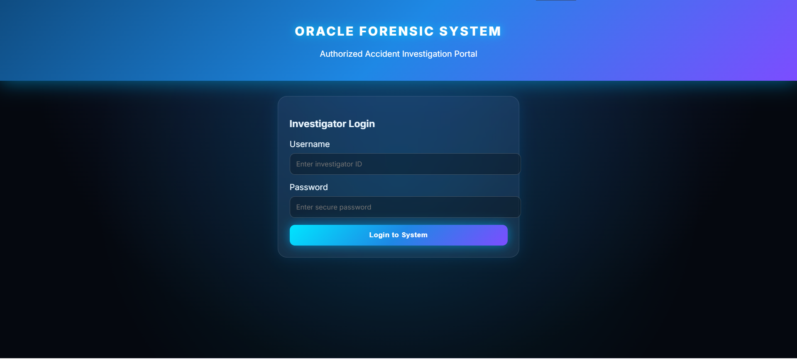
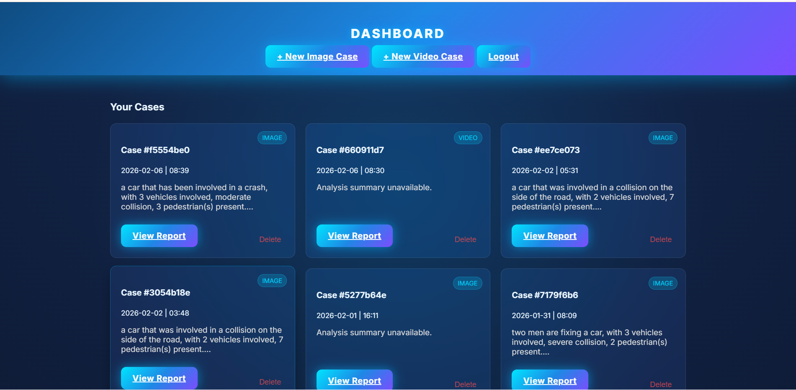

# 🕵️‍♂️ Oracle Forensic System

> **Authorized Accident Investigation Portal**
> *Automated Forensic Analysis using AI & Computer Vision*


## 📖 Overview

The **Oracle Forensic System** is a web-based investigation tool designed to assist forensic analysts and accident investigators. It leverages state-of-the-art Artificial Intelligence to automatically analyze crime scene images and accident videos.

The system detects vehicles, pedestrians, and other critical objects, generates descriptive captions for the scene, and compiles comprehensive **PDF Forensic Reports** automatically.

## ✨ Key Features

* **🔐 Secure Authentication:** User login system with hashed passwords (Bcrypt) and session management.
* **🖼️ Image Forensics:**
    * **Object Detection:** Identifies cars, persons, trucks, and traffic signs using **YOLOv8**.
    * **Scene Captioning:** Generates textual descriptions of the scene using **Salesforce BLIP**.
* **🎥 Video Forensics:**
    * Frame-by-frame analysis of accident footage.
    * Automated extraction of key evidence frames.
* **📄 Automated Reporting:** Generates professional **PDF Reports** containing:
    * Case details & timestamps.
    * Annotated evidence images.
    * AI-generated summary and object counts.
* **☁️ Cloud Ready:** Dockerized and optimized for deployment on **Hugging Face Spaces** or **AWS**.

---

## 🛠️ Tech Stack

* **Frontend:** HTML5, CSS3, Jinja2 Templates
* **Backend:** Python (Flask)
* **Database:** MongoDB Atlas (Cloud)
* **AI Models:**
    * `ultralytics` (YOLOv8n - Nano model for speed)
    * `transformers` (BLIP Image Captioning)
    * `deepface` (Facial Analysis - Optional)
* **Deployment:** Docker, Gunicorn

---

## 🚀 Installation & Setup

### Prerequisites

* Python 3.10 or higher
* MongoDB Atlas Account (Connection String)
* Git

### 1. Clone the Repository

```bash
git clone [https://github.com/YOUR_USERNAME/oracle-forensic.git](https://github.com/YOUR_USERNAME/oracle-forensic.git)
cd oracle-forensic

```

### 2. Create a Virtual Environment

```bash
python -m venv venv
# Windows
.\venv\Scripts\activate
# Mac/Linux
source venv/bin/activate

```

### 3. Install Dependencies

```bash
pip install -r requirements.txt

```

### 4. Configure Environment Variables

Create a file named `.env` in the root directory and add the following:

```ini
# Security
SECRET_KEY=your_super_secret_key_here

# Database (Replace with your actual MongoDB URL)
MONGO_URI=mongodb+srv://<username>:<password>@cluster0.example.mongodb.net/oracle_forensic?retryWrites=true&w=majority

# AI Configuration
# Use 'yolov8n.pt' (Nano) for speed/cloud free tier, or 'yolov8m.pt' for accuracy
YOLO_WEIGHTS=yolov8n.pt
CAPTION_MODEL=Salesforce/blip-image-captioning-base

# Storage Paths
STORAGE_DIR=data/uploads

```

### 5. Create an Admin User

Since the database is initially empty, run the included script to create your first admin user:

```bash
python add_admin.py

```

*(This creates a user `admin` with password `admin123`)*

### 6. Run the Application

```bash
python app.py

```

Access the app at: `http://localhost:7860`

---

## 🐳 Docker Deployment (Recommended)

This project is fully containerized. To run it using Docker:

1. **Build the Image:**

```bash
docker build -t oracle-forensic .

```

2. **Run the Container:**

```bash
docker run -p 7860:7860 --env-file .env oracle-forensic

```

---

## 📂 Project Structure

```text
oracle-forensic/
│
├── core/                   # Backend Logic
│   ├── db.py               # MongoDB Connection & User Auth
│   ├── pipeline.py         # AI Image Processing Pipeline
│   ├── video_pipeline.py   # AI Video Processing Pipeline
│   ├── pdf_report.py       # PDF Generator
│   └── ...
│
├── templates/              # HTML Frontend
│   ├── login.html
│   ├── dashboard.html
│   ├── report.html
│   └── ...
│
├── static/                 # CSS & Assets
├── data/                   # Local storage for uploads/reports (GitIgnored)
├── app.py                  # Main Flask Application
├── Dockerfile              # Docker Configuration
├── requirements.txt        # Python Dependencies
└── README.md               # Documentation

```

## 🤝 Contributing

1. Fork the repository
2. Create your feature branch (`git checkout -b feature/AmazingFeature`)
3. Commit your changes (`git commit -m 'Add some AmazingFeature'`)
4. Push to the branch (`git push origin feature/AmazingFeature`)
5. Open a Pull Request

---

> **Created by Jo**
> *Final Year Project - 2026*

```
## 📸 Screenshots

| **Investigator Login Portal** | **Case Dashboard** |
|:---:|:---:|
|  |  |

> *The system features a secure, dark-themed interface designed for low-light environments typical in forensic labs.*

```
